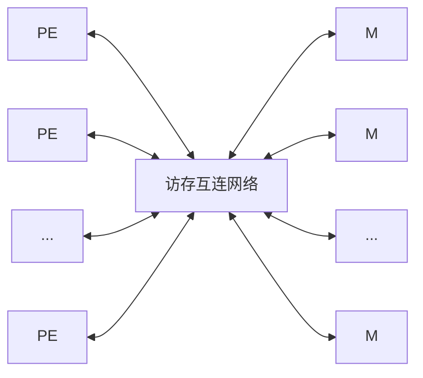
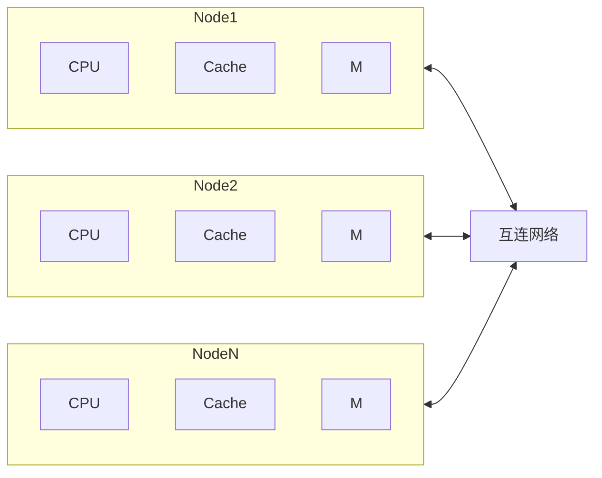

# 并行计算机体系结构

## 并行计算机的分类

并行计算机主要指两台或两台以上的处理机连接起来可以并行操作的机器, 亦可称之为并行多处理机.

按照指令流和数据流的不同, 可以把并行计算机分成下面两类:
1. **单指令流多数据流 (SIMD)**: 各处理机同一时刻执行相同的指令, 处理不同的数据.
2. **多指令流多数据流 (MIMD)**: 各处理机同一时刻执行不同的指令, 且处理不同的数据.

## SIMD型并行机

SIMD型并行机主要有一下三类:
1. **向量流水线处理机**: 一般通过时间重叠技术实现并行处理; 把一个功能部件分成几个不同的部分, 每一部分执行部分功能.
2. **阵列处理机**: 由成千上万个功能非常简单的处理机构成, 数据以某种方式流经各台处理机, 由它们进行处理.
3. **并行机**: 通过一台前端机执行指令, 而并行机根据指令对数据进行处理, 如CM-2、Mas Par MP-1、MP-2.

## MIMD型并行机

促使MIMD结构发展的因素主要有以下两点:
1. 支持更高的并行度 (子程序级、任务级或更高).
2. 多台处理机的性价比远比一台处理机高.

按照存储方式的不同, 我们可以将MIMD型并行机可以分成以下三类:
1. **共享存储并行多处理机**.
2. **分布存储并行多处理机**.
3. **分布共享存储并行多处理机**.

### 共享存储MIMD并行多处理机

共享存储MIMD并行多处理机是指将多台处理机通过*访存互联网络*共享一个*统一的内存空间*, 并通过该内存空间来实现*处理机间协调*的并行计算系统, 也称为对称多处理机 (SMP, Symmetric Multiple Processors).

共享存储MIMD并行多处理机的内存空间也可由多个存储器模块构成, 其结构如图所示:

在该类并行机中, 每台处理机可以执行相同或不同的指令流, 可以直接访问到所有数据, 处理机间通信是借助*共享主存*来实现的.

链接处理机与存储模块之间的网络类型大致可分为以下三种:
1. **总线互连结构**: *分时共享总线*为每台处理机提供了访问内存模块的*均等机会*, 一次只能有一台处理机访问总线; 为了增加处理机台数, 可以采用多总线结构.
2. **Crossbar互连结构**: 使用*交叉开关*, 在每个可能的处理机/存储器模块之间提供专用通道, 从而防止出现访存竞争冲突. 这种互连配置价格较贵, 处理机数目一般在4-16台之间.
3. **多级互连网络结构**: 它是Crossbar和总线性价比的折中. 通过*多级互连开关互连网络* (由多级小型交换单元级联构成, 数据通过各级单元按地址逐段选路转发) 连接处理机与存储器模块; 相对于前面两种结构, 具有更好的可扩展性, 但内存访问延迟时间较长.

在共享存储MIMD并行机中, 处理机和内存模块分别位于互连网络的两侧, 每台处理机通过互连网络访问内存模块, 且所有处理机的访问方式都是一样的, 机会均等. 同时, 还可以在每台处理机中设置少量的局部Cache, 以减轻互联网络的负载. 我们称这种共享存储结构为*一致内存访问 (UMA, Uniform Memory Access)结构*. 

UMA结构的优点在于给每台处理机提供同样的访存带宽、访存机会和访存延迟时间, 处理机与内存模块相对于互连网络呈对称分布, 处理机之间是完全等价的, 由此可以解释为什么我们也称之为SMP.

共享存储MIMD并行多处理机的主要问题是其可扩展性差且不可避免地遇到内存访问瓶颈的问题, 当处理机需要同时访问共享全局变量时, 产生内存竞争现象, 严重影响效率. 其优点是容易进行并行程序设计, 能保持较好的负载平衡, 适合许多中小规模应用问题的计算和事务处理.

### 分布存储MIMD并行多处理机

分布存储MIMD并行多处理机中的每台处理机都有自己可直接访问的内存 (局部存储器). 每台处理机称为系统中的一个节点, 节点之间通过*互连网络相互连接*. 每台处理机只能直接访问局部存储器, 对远端存储器的访问必须以*消息传递*的方式, 通过互连网络来完成. 互连网络通常有总线互连结构、环结构、树结构.

> 注: 共享存储MIMD并行多处理机的(访存)互连网络和分布存储MIMD并行多处理机的互连网络在概念上是有所区别的, 在讲到互连网络时注意区分.

分布式存储并行机具有很好的可扩展性, 是实现超大规模科学与工程计算的唯一途径. 如果要求获得较高性能, 必须通过消息传递来进行并行程序设计, 并行程序设计复杂, 不容易被用户接受.

消息传递型分布式存储MIDI并行机主要有下面两类:
1. **大规模并行计算机 (MPP)**: 由成百上千的功能相同的处理机通过*互联网络*连接而成, 如: IBM SP-2, Intel Paragon XP/S, Cray T3D, 国产YH-3等.
2. **网路并行机群系统**: 由同构或异构型串行或并行计算机通过*快速局域网或广域网*相互松散连接而成, 如: 工作站机群、PC机群等.

由于工作站机群、PC机群充分利用各个单位自己的现有资源来组织并行计算, 特别适合于财力不足的科研单位和大学研究所, 近年来得到了快速的发展.

### 分布共享存储MIMD并行多处理机

为了结合MPP的可扩展性和SMP的并行程序设计的容易性, 提出一种新的结构, 即分布共享存储 (DSM) MIMD并行计算机.

DSM结构将SMP的内存模块分布到每台处理机, 成为它们的局部内存, 构成一个同一的节点, 节点之间通过互连网络相互连接. 每台处理机可以直接访问它的局部内存, 也可以通过互连网络直接访问别的处理机的局部内存, 只是延迟时间较长.

DSM提供给用户的是统一的内存空间, 但在物理上类似于MPP结构, 是分布内存的, 故称之为分布共享存储结构并行机, 也称之为*非一致内存访问 (NUMA, Non-Uniform Memory Access) 结构*.

DSM结构具有较好的可扩展性, 可以减轻SMP结构的访存瓶颈, 但是又继承了其并行程序设计的容易性.

DSM的关键技术在于如何保持处理机内部的Cache及内存之间的一致性, 不解决这些问题同样会阻碍DSM的可扩展性和性能的发挥.