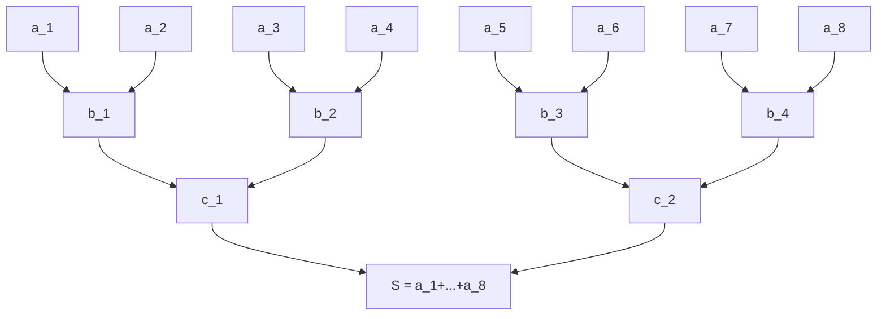
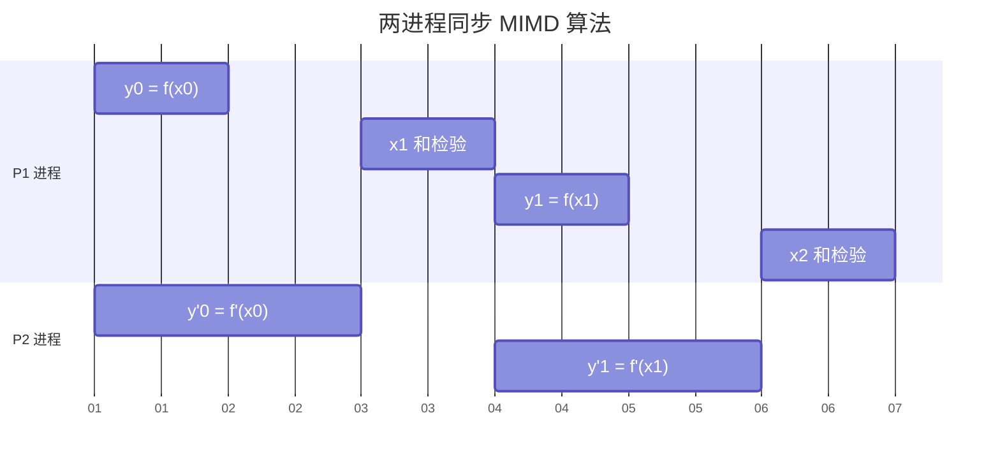
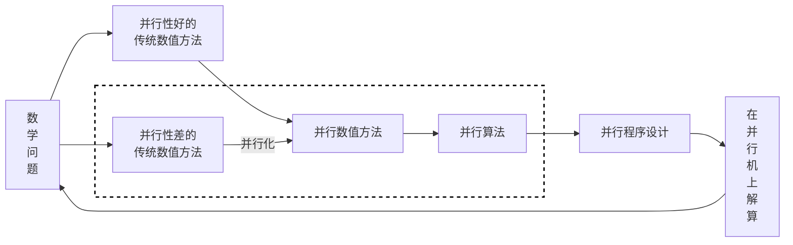

# 并行算法 (1)

## 概述

算法是解题方法的精确描述, 它是一组有穷的规则, 这些规则规定了解决某一特定类型问题的一系列运算. 所谓并行算法, 可以简单地认为是在各类并行计算机上求解问题的算法. 

为了比较精确地给出并行算法的定义, 我们需要用到计算机科学中的进程 (Process) 的概念. 一个*进程*是指一段(串行)程序连同其数据在(单)处理机上的动态执行过程. 简单地说, 进程可以理解为顺序执行的一组操作或一段程序.

接下来给出并行算法的精确定义: 并行算法是一些可同时执行的诸进程的集合, 这些进程相互作用和协调动作, 从而达到对给定问题的求解.

并行算法可以从不同的角度加以分类:

1. **数值**和**非数值**并行算法.
2. **同步**和**异步**并行算法.
3. **SIMD**和**MIMD**并行算法等.


**数值并行算法**

数值计算是指基于代数关系的一类计算问题, 基本上属于数值分析 (对以数字形式表达的问题求解) 的范畴, 研究数值计算问题的并行算法称为数值并行算法.

**非数值并行算法**

非数值计算是指基于关系运算的一类计算问题, 基本上属于符号 (如字符、数字图形或别的一些记号) 处理的范畴, 研究非数值计算问题的并行算法称为非数值并行算法.

**同步算法**

同步算法 (Synchronized Algorithm) 是指某些进程必须等待别的进程的一类并行算法. 因为一个进程的执行依赖于输入数据和系统中断, 所以全部进程均必须同步在一个给定的时钟, 以等待最慢的进程. 一般而言, 运行在SIMD计算机上的并行算法为同步并行算法 (Synchronous Paralle Algorithm).

**异步算法**

异步算法 (Asynchronized Algorithm) 是指进程执行一般不必相互等待的一类并行算法. 异步算法具有一下性质:
1. 有一个可以为所有进程存取的整体变量集合.
2. 当进程的一个阶段完成后, 这个进程首先读某些整体变量, 然后根据这些变量的值及上一阶段刚得到的结果, 该进程修改某些整体变量, 接着启动下阶段或结束它本身.

在异步算法中, 进程之间的通信是通过整体变量可共享数据来实现的. 进程之间没有同步算法那样明显的依赖关系. 异步算法的主要特征是它的进程永不等待输入, 而只根据整体变量的最新信息来继续.

**SIMD算法**

面向SIMD计算机的并行算法就是SIMD算法. SIMD算法依据 "P台处理机在同一时刻对各自的数据执行同一指令", 具有明显的同步性, 属于同步并行算法.

**MIMD算法**

面向MIMD计算机的并行算法就是MIMD算法. MIMD算法依据 "P台处理机在同一时刻对各自的数据执行不同指令". MIMD算法有同步和异步之区别.

由于使用并行和向量计算机, 我们面临的一个挑战: 在设计算法时, 必须充分利用具体并行计算机的特征.

原有的一些最好的串行算法变成了不能令人满意的算法, 需要重新改造甚至抛弃. 而在串行机上许多远不是最优的"老"算法, 由于其并行性而焕发了"青春".

传统的数值方法正在经历并行性的改造并在机器上得以检验, 发展新的并行算法的研究工作正在向纵深发展.

## 数值并行算法引例

由于本课程为并行数值计算, 我们主要关注于数值并行算法.

数值并行算法的研究内容主要包含:
1. 在传统数值计算方法基础上进行并行性改造和创新.
2. 已经具有明显并行性的传统数值方法和新方法在并行机和向量机上的算法实现和程序设计.

### 例1. SIMD算法

考虑 $n$ 个数 $a_1,\dots,a_n$ 的求和问题. 其串行算法为:
```
s = a_1
DO i=2,...,n
	s = s + a_i;
```
显然不适合并行计算.

下图给出了 $n=8$ 时的一种并行算法, 称为**结合扇入算法**, 其可由如下4个进程 $P_1,P_2,P_3,P_4$ 组成



进程如下:

|          $P_1$           |          $P_2$           |          $P_3$           |          $P_4$           |
| :----------------------: | :----------------------: | :----------------------: | :----------------------: |
| $b_1 \leftarrow a_1+a_2$ | $b_2 \leftarrow a_3+a_4$ | $b_3 \leftarrow a_5+a_6$ | $b_4 \leftarrow a_7+a_8$ |
| $c_1 \leftarrow b_1+b_2$ |                          | $c_2 \leftarrow b_3+b_4$ |                          |
|  $S \leftarrow c_1+c_2$  |                          |                          |                          |

### 例2. 同步MIMD算法

考虑求一元方程 $f(x)=0$ 的根的Newton迭代法: 

$$
x_{i+1}=x_{i}-\frac{f(x_i)}{f'(x_i)},\quad i=0,1,2,\dots
$$

我们将每次迭代分成三个算法元: 

$$
\begin{gathered}y_i\leftarrow f(x_i)\\ y'_i\leftarrow f'(x_i)\\ x_{i+1}\leftarrow x_i-y_i/y'_i\text{ 及检验精度}\end{gathered}
$$

在一般情况下, 计算 $f(x_i)$ 和 $f'(x_i)$ 所含操作步数是不同的. 因此, 在具有两台速度相同的处理机系统上, 根据公式进行并行计算时, 每次迭代都须同步.

假设计算 $f'(x_i)$ 比计算 $f(x_i)$ 花费更多操作, 下图给出了一种两进程同步MIMD算法:


### 例3. 异步MIMD算法

*通过公用变量或公用数据来实现进程间的通信*是异步算法的显著特征. 异步算法的进程间没有像同步算法那样有明显的依赖性, 各进程不需要时间以等待信息输入, 不论公用变量中当前信息是什么, 各进程将根据这些信息决定继续执行或终止. 

为了保证逻辑上的正确性和进行有意义的工作, 如使必须更新的若干公用变量的更新过程全部完成或解决公用变量的存储冲突等, 必须允许异步算法中出现某些随机的临时封锁.

由于公用变量更新信息有很大的随机性, 直接法不能包含这种量, 所以异步算法基本上是迭代法, 并且与传统迭代法有很大区别.

仍以求 $f(x)=0$ 的根为例, 引进公用变量 $v_1,v_2,v_3$ , 分别含 $f(x),f'(x),x$ 的当前值. 仍设计算 $f'(x_i)$ 比计算 $f(x_i)$ 花费更多操作, 下图所示是一个比较合理的两进程异步MIMD算法, 或称为异步迭代算法:

$P_1$ 更新 $v_1$ 和 $v_3$ , 且检验精度, $P_2$ 更新 $v_2$ .

```mermaid
gantt
    title 异步 MIMD 算法
    dateFormat  X
    axisFormat  %s
    
    section P1 进程
    v1 ← f(v3)               :p1_a1, 0, 10s
    v3 ← v3 - v1/v2 检验      :p1_a2, after p1_a1, 10s
    v1 ← f(v3)               :p1_b1, after p1_a2, 10s
    v3 ← v3 - v1/v2 检验      :p1_b2, after p1_b1, 10s
    v1 ← f(v3)               :p1_c1, after p1_b2, 10s
    v3 ← v3 - v1/v2 检验      :p1_c2, after p1_c1, 10s
    
    section P2 进程
    v2 ← f'(v3)              :p2_1, 0, 24s
    v2 ← f'(v3)              :p2_2, after p2_1, 24s
    v2 ← f'(v3)              :p2_3, after p2_2, 24s
```


假定变量的初值 $v_1=0$ , $v_2=f'(x_0)$ , $v_3=x_1$ , 则依照上图计算时, $v_3$ 得出的根的近似值序列如下: 

$$
\begin{gathered}x_2 = x_1 -\frac{f(x_1)}{f'(x_0)}\\ x_3 = x_2 - \frac{f(x_2)}{f'(x_1)}\\ x_4 = x_3 - \frac{f(x_3)}{f'(x_2)}\end{gathered}
$$

因此, 递推关系形如: 

$$
x_{i+1}=x_i - \frac{f(x_i)}{f'(x_j)}
$$

其中 $j<i$ , 当 $i\to\infty$ 时, $j\to\infty$ , 但事先无法确定 $j,i$ 的关系, 而且此递推形式只适合"计算 $f'(x_i)$ 比计算 $f(x_i)$ 花费更多操作"的情形.

这已经不是传统的Newton迭代法, 而是一种异步迭代法, 或者可称之为混乱迭代法, 故必须对产生的序列 $\{x_i\}_{i=1}^{\infty}$ 的性质进行深入细致的分析.

---

按照传统的概念, 数值计算方法和程序设计是两门密切相关的不同学科. 算法是解题方法的精确描述, 它是一组有穷的规则, 这些规则确定了在计算机上求解某一问题的一系列运算. 根据算法可以直接地进行程序设计.

对于串行机而言, 数值方法 (可简称为解法) 与算法的关系比较简单, 解法一旦确定, 有效的串行算法和计算程序也随之产生, 其可在任何一种串行机上得到实现.

在并行计算系统出现以后, 区别解法和算法这两个概念的重要性增加了, 同样一个解法针对不同类型的并行机可以有着差异很大的算法和程序设计. 并行算法一经给出, 并行程序即可直接由该算法设计产生. 算法是受到数值方法影响和制约, 解法对算法有决定意义. 有效的并行算法一般必须建立在容易并行实现的数值方法基础之上, 具有良好并行性的数值方法称为并行数值方法.


虚线所界定的内容构成了一个与并行算法直接相关的相当广泛的研究领域. 为了在并行机上实现给定问题的求解, 需要完成图中所示任务的一个大循环. 对于所要求解的数学问题, 如果传统数值方法已具备良好的和明显的并行性, 则可直接进入并行算法设计; 倘若传统方法没有良好的并行性, 则应对其进行并行性改造和创新.

具备并行性的传统数值方法: 用主元素Gauss消元法解稠密线性代数方程组、矩阵与向量的乘法运算、求解发展方程的显示差分格式、求解线性代数方程组的Jacobi迭代法等.

难于并行化的传统数值方法: 递推问题、求解抛物型方程的隐式差分格式、椭圆型方程的直接近似解法和若干迭代解法等.

这些难于并行化的传统数值方法在大规模科学计算中占有重要地位, 其并行化倍受重视, 近年来有了很大的发展, 提出了一些新技术和新方法. 同时也产生了许多新的理论问题, 如: 并行迭代法的收敛性、收敛速度的估计; 并行化差分格式的相容性、收敛性、稳定性等. 这些问题都需要进行进一步深入的研究和分析.

需要指出, 并行数值方法的发展并不局限于上述所示框图, 例如不少学者在数学模型一级进行并行化研究, 利用分而治之原则建立了求解数学物理问题的区域分裂法. 甚至为了并行计算的目的, 能够建立全新的计算模型, 如流体力学计算的格子气方法等.

传统数值方法在并行化方面正面临着新的挑战, 也面临着理论上取得突破和新发展的大好机遇. 并行计算新时期的出现孕育着并行数值方法大发展时期的到来, 并行数值方法的新领域目前正在呈现出蓬勃发展的势头.